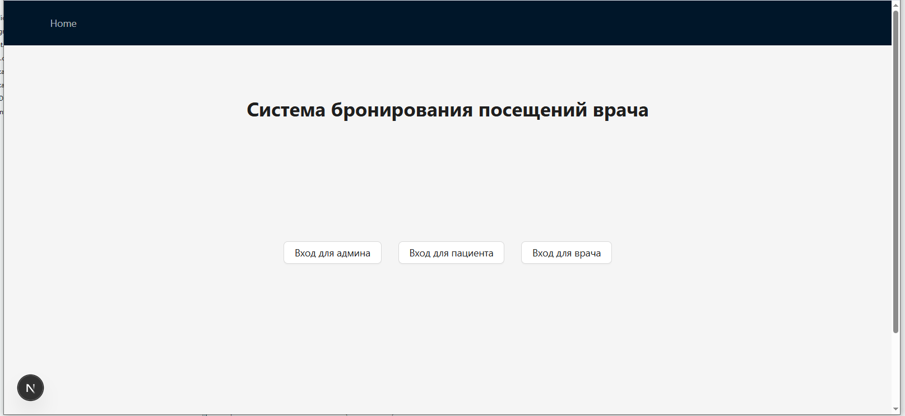
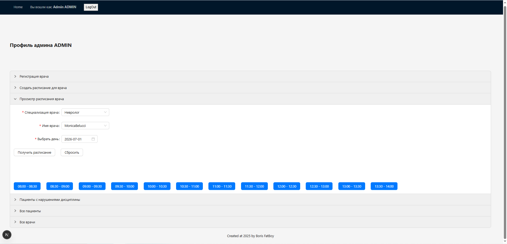
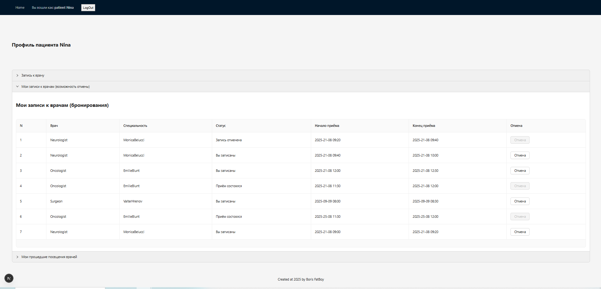
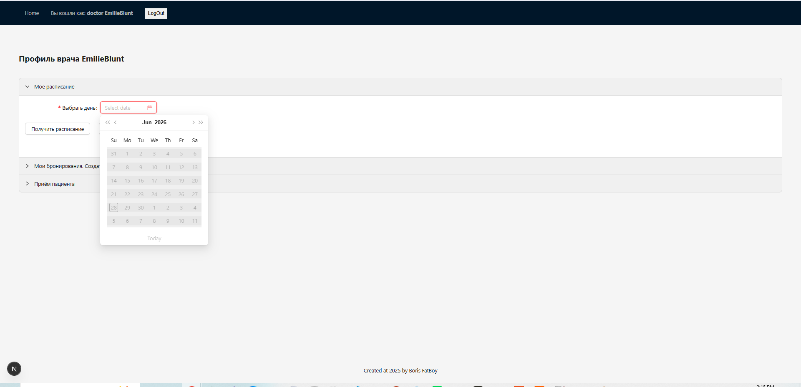

# Medical-Booking
Система подбора и записи к врачу.

## Стек технологий:

- .Net Framework
- Web API
- Entity Framework
- SQLite,
- NextJS
- ReactJS
- Typescript
- antd

## Особенности реализации

- Чистая архитектура.

- Авторизация с JWT. Токен хранится в localStorage (для `pet-project` приемлимо, для `production` нет).

- БД SQLite. Хранится локально в `\backend\MedicalBookingProject\src\MedicalBookingProject.DataAccess\Database\`.

- Все пользователи разбиты на три роли: админ, врачи, пациенты.

- БД лежат готовые пользователи с разными ролями, и ими можно сразу начинать пользоваться (логины и пароли ниже).

## Скачать
1. Склонировать
2. Поставить пакеты и зависимости:
- Предполагается, что уже установленые платформы `.Net` и `Node.js`.
- `VS Community` должна сама подхватить и поставить пакеты. Если этого не произошло, то вызывается консоль разработчика 'crtl+`'. Там выполнить `dotnet restore`.
- Войти в папку 'Medical-Booking\frontend\medical-booking\node_modules' и выполнить 'npm install'.

## Запустить
- Перейти в папку 'Medical-Booking\backend', щёлкнуть по файлу решения (открыть VS с проектом). Запустить бекенд (F5\зелёный треугольник).
- Перейти в Medical-Booking\frontend. Правой клавишей нажимаем на пустом поле и выбираем 'open with Visual Studio'
- В папке 'Medical-Booking\frontend' открыть консоль разработчика и выполнить команду 'npm.cmd run dev' (если из 'cmd' то 'npm run dev').
Если страница не открылась сама, то делаем это вручную 'http://localhost:3000/'.

## Пользоваться  
**Админ**
- Войти под админом.
- Выбрать врача либо создать нового.
- Создать расписание для врача.
- Выйти.

**Пациент**
- Зарегистрироваться как пациенту либо зайти под готовым. 
- Забронировать приём у врача. Можно отменить бронирование.
- Выйти.

**Врач**
- Зайти как врач. 
- Открыть своё расписание. Выбрать забронированный (красный) слот. 
- Создать приём у врача. Заполнить все формы.

## Готовые пары логин-пароль

- Админ (Admin@gmail.com, AdminPassword)

- Пациенты (Nina@mail.de, NinaPassword), (Alla@mail.uk, AllaPassword), (basil@mail.uk, basilpassword)

- Врачи (EmilieBlunt@mail.ru, EmilieBluntPassword), (JamesBond@mail.ru, JamesBondPassword)

## Идея / источник вдохновения

[demo](https://nevonprojects.com/doctor-appointment-booking-system/)

